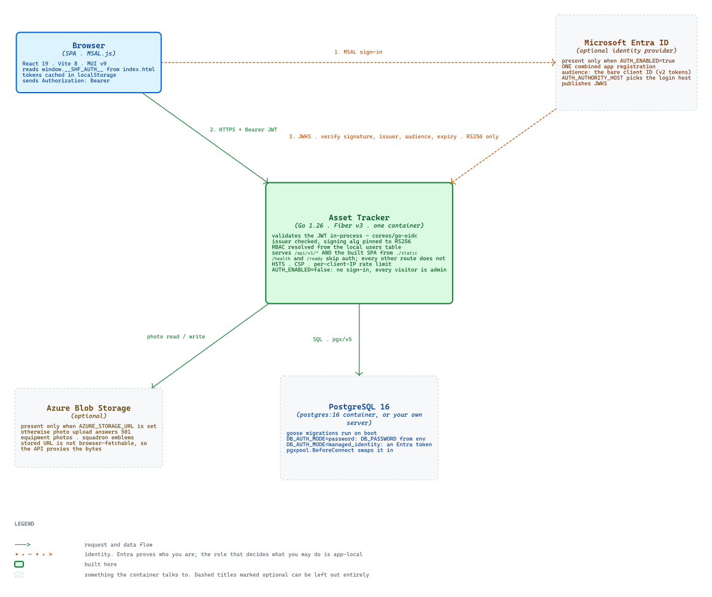
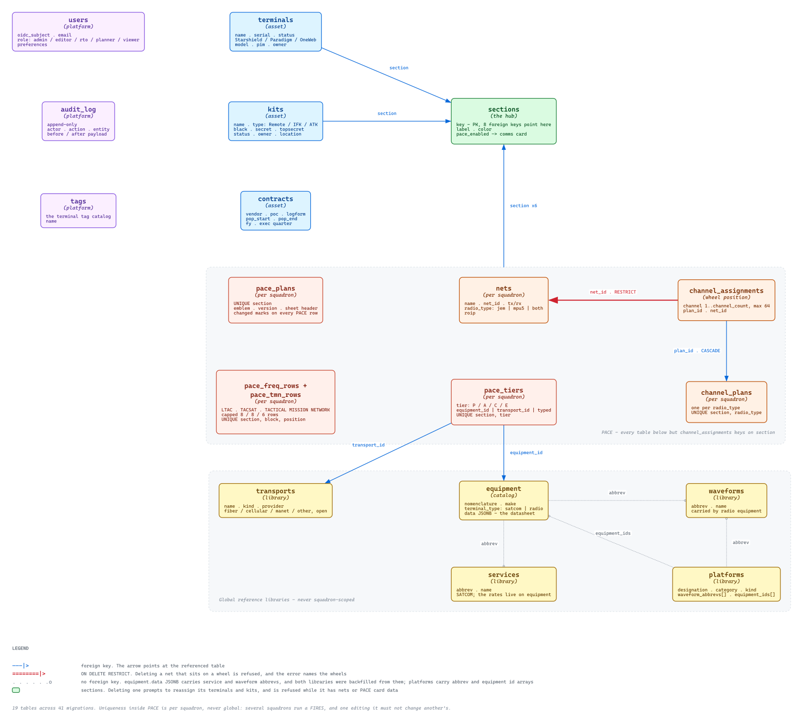
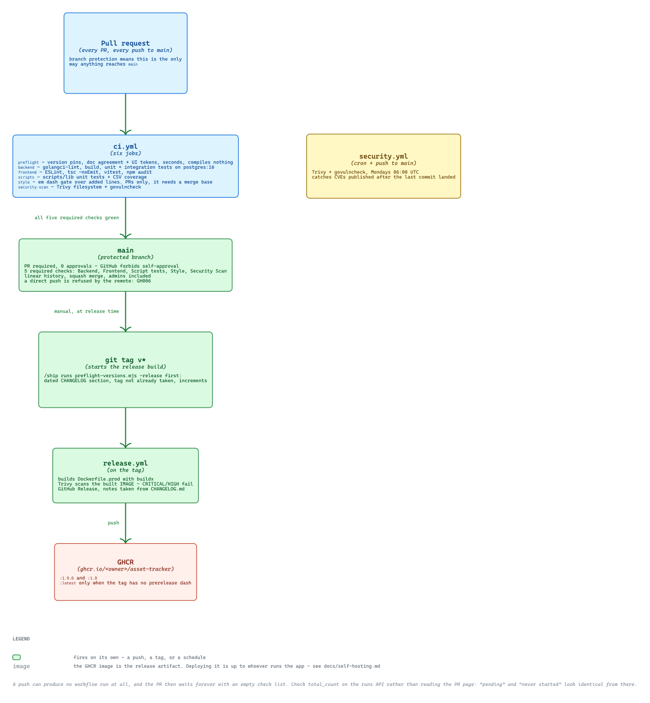

# Asset Tracker

> **New here?** Read [`START_HERE.md`](START_HERE.md) first. It gets the app running in about fifteen minutes
> with nothing but Podman or Docker, and tells an AI assistant what to read before it changes anything.

Tracks terminals, kits, contracts and field equipment across squads and sections, and plans the comms that run on them. An Equipment Catalog holds SATCOM and radio data sheets, which draw on global waveform, services, transport and platform libraries; a joint compatibility matrix reads every waveform against every asset, ours and theirs; a per-squadron nets library feeds a PACE comms card built to print. Editors keep the inventory accurate (status, owner, kit, serial, notes); admins manage roles, sections, and review the audit log; everyone authenticated can read and export.

Built on **Go + Fiber** (backend), **React + Vite** (SPA) and **PostgreSQL**. A single container hosts both the API and the built frontend. Sign-in is optional: with `AUTH_ENABLED=true` the Go process validates Microsoft Entra ID tokens in-process via `coreos/go-oidc` and the SPA acquires them through MSAL.js; with `AUTH_ENABLED=false` there is no identity provider at all, which is how the dev stack and the self-hosted stack run.

<picture>
  <source media="(prefers-color-scheme: dark)" srcset="./diagrams/system-architecture-dark.svg">
  
</picture>

## Features

- **Dashboard** - the landing page in the header picker (`/dashboard`), a read-only overview of the fleet. Terminal tiles break down by family (Starshield / Paradigm / OneWeb) with per-model subtotals, and both terminals and kits carry the same status row (Available / ALERT / On Mission / Reserved / INOP) using identical buckets and colours so the two read against each other at a glance. Section and kit-type breakdowns sit beneath. Every tile is a link into the matching filtered list, so the dashboard is a navigation surface rather than a report
- **Terminals** - list, search, paginate, inline-edit, side-drawer detail, free-form section grouping, and model classification across three families: **Starshield** (Mini / HP), **Paradigm** (Hornet / Ragno - each with a dedicated PIM # field), and **OneWeb** (OW-7 / OW-10 / OW-11). Sidebar shows collapsible family groups with model deep-links; in-page variant filter is multi-select with server-side filtering so totals and pagination reflect filtered results
- **Kits** - top-level asset domain parallel to Terminals: list, search, paginate, inline-edit, side-drawer detail, and section grouping. Classified by **type** (Remote / IFK / ATK, sidebar deep-links + multi-select in-page filter) with three independent network flags (**BLACK / SECRET / TS**) shown as check columns and drawer checkboxes. Assigned-to owner fields, location, and status stat-strip. Full CSV import/export/template. Migration `022_create_kits.sql`.
- **Equipment Catalog** - browse grid of SATCOM/radio terminal data sheets with search, a type filter, and a facet sidebar that narrows the catalog the way a shopping site does: multi-select values with live counts (bands, manufacturer, operational mode, waveforms, services) and numeric ranges with preset cuts plus a custom threshold (weight normalised across lbs/oz/lbs-oz, transmit power, range in mi/km). Counts exclude their own facet, so checking one band never falsely reports the others as empty, and a record with the field left blank is excluded from a range but surfaced as a counted **Not specified** toggle rather than vanishing. Filters live in the URL, so a narrowed catalog is a link. Full data-sheet view per item (specs, frequencies, features, compatibility matrix) with a print route (`/catalog/:id/print`). 3-pane editor (list / form / live preview) for admins and editors; photo upload via Azure Blob Storage (Managed Identity, no SAS tokens). SATCOM services carry CIR/MIR rates or a **Best Effort** flag for services sold without a committed rate. The data sheet also exports to a `.png`, the clipboard or a single-slide `.pptx`, captured from the same page box the print CSS produces so the slide cannot drift from the printout and honours the scale slider. The four shared reference tables - waveforms, SATCOM services, transports and platforms - browse at `/catalog/comms-library`, read-only for everyone and editable by the roles that own each one; it is named Comms Library rather than RF Library because transports include fibre circuits, which are not radio at all. Any of the four prints from a read-only route (`/catalog/comms-library/print`) with the add form and row pencils dropped, and shares to a `.png`, the clipboard or a `.pptx` from the same menu the data sheet uses. A comparison view at `/catalog/compare` puts any number of records side by side on any subset of parameters, SATCOM and radio together, distinguishing a spec a record simply lacks from one that does not apply to its type; it prints as a balanced, page-repeating table at `/catalog/compare/print` with a Paper (ink-on-white, for a printer) or Dark (screen-matched, for a shared PDF) palette, and its PNG/clipboard/PowerPoint export stays dark regardless of the print palette chosen. A Fit to one page toggle shrinks the printed comparison on both axes, columns and rows together, down to 70%, and the live page reports the resulting page count beside it. Migrations: `017_create_equipment.sql`, `018_create_waveforms.sql`.
- **Global Waveform Library** - centrally managed waveform reference table (`waveforms`). Editors define waveforms once (abbrev + name + description); radio equipment records link to them via toggle chips in the Section 03 editor panel. Supports the compatibility matrix between radio types. Browsed and edited in the **Comms Library** (`/catalog/comms-library`), where each row counts the assets carrying it and names them, or reads **unused** - the case the facet rail cannot show, since its values come from the equipment pool rather than the library. Deleting a waveform that a catalog radio or a platform still carries is refused with a 409 naming them, and renaming an abbrev carries the new spelling onto every record that used the old one.
- **Global Services Library** - the SATCOM twin of the above (`services`). Editors define services once (abbrev + name + description); SATCOM equipment records link to them via toggle chips in the Section 03 editor panel. CIR, MIR, and the Best Effort flag stay on the equipment record, because two terminals on the same service carry different committed rates - the chips choose which services a terminal offers, the rows beneath them carry the rates and the datasheet ordering. Browsed and edited in the **Comms Library** (`/catalog/comms-library`), the same place as waveforms and transports, and like them each row counts and names the terminals offering it. Unlike waveforms, writing is limited to admin and editor; `rto` is the radio side of the split. Migration `026_create_services.sql`, which also backfills the library from every abbrev already typed into `equipment.data.services`.
- **Transport Library** - the third global reference table (`transports`), for the paths a PACE tier names when it is not a SATCOM terminal: a fibre circuit, a cellular plan, a MANET mesh, or whatever else a squadron actually runs. Each entry carries a name, a kind, a provider and a description, and is browsed and edited in the **Comms Library** (`/catalog/comms-library`) beside the Waveform and Services libraries. That route is why this table is readable at all: transports have no browse tab of their own, so until it existed the only way to see one was to hold a write role and open the catalog editor. **Kind is an open vocabulary**: four defaults (fiber, cellular, manet, other) are offered, and anything already in use joins the list, so a squadron picks `+ Add new kind…` rather than filing an unanticipated path under "other". Kinds are normalised to lowercase, so the list cannot fill with one kind spelled three ways. The unique index is case-insensitive on `name`, because a transport has no abbrev to key on. Writable by admin, editor, `rto` and `planner`, the same writers as nets, PACE and platforms. Migration `033_create_transports.sql`.
- **Platform Library and joint compatibility matrix** - the fourth global reference table (`platforms`) holds external comms platforms - an F-35, a DDG, a coalition vehicle - that are not equipment we own, each with a designation, popular name, category, kind and operator. **Category and kind are open vocabularies** like transport kinds: organic / joint / coalition and aircraft / ship / ground vehicle / ground station are suggestions, normalised to lowercase. A platform lists the waveforms it carries directly, the catalog radios it carries, or both, in the **Comms Library** (`?lib=platforms`), writable by PACE's writers. The matrix at `/catalog/compatibility` puts every waveform against every platform and every catalog radio, filtered by category chips and a column picker held in the URL, so any set of assets can be read side by side - the input to a PACE across a joint force. It is **live**: a carried radio's waveforms are read from its catalog record at render, so editing the radio moves the matrix, where the per-radio matrix on a data sheet deliberately snapshots. Prints landscape at `/catalog/compatibility/print`, and exports to a `.pptx`, the clipboard or a `.png` from the same share menu as the compare page. Migration `040_create_platforms.sql`.
- **PACE Planner** - per-squadron comms card combining two radio wheels (JEM + MPU5), 16 channels each by default and sizable from 1 to 64, with a Primary/Alternate/Contingency/Emergency service plan, destined for a single landscape printout. Wheels render as a numbered dial with net labels stacked outside the ring and joined by leader lines, so every position stays legible at print size; the squadron emblem sits in the hub. Sidebar group with a sub-item per card-bearing squadron. A card editor at `/pace/:section/edit` writes the whole card in one save; a radio omitted from the payload is left untouched, a radio sent with no channels clears that wheel. Assigning a net is validated server-side against the squadron that owns it and the radio that carries it. The sheet's middle band carries free-form LTAC and TACSAT frequency tables and a TACTICAL MISSION NETWORK box, capped at 8, 8 and 6 rows so the PACE tiles stay on the page. The four PACE tiles are filled from the Equipment Catalog, the Transport Library, or a typed line, with the terminal photo and its CIR/MIR rates resolved server-side so the printed sheet renders from one payload. The card also exports to a `.png`, the clipboard or a landscape `.pptx` slide whose text is **native and editable in PowerPoint** rather than flattened into the picture, with the card's own fonts embedded so it renders correctly on a machine that does not have them. **Changed marks**: every field in the editor carries a tick, and a ticked value prints red on the card, the print sheet and both exports, so whoever a revised card is handed to can see what moved; an optional version label (`v2`) prints after the date, and "Clear all marks" starts the next revision. The marks are set by hand, not computed by comparing saves. Migrations `025_create_channel_plans.sql`, `027_create_pace_plans.sql`, `031_add_pace_emblem.sql`, `032_create_pace_sheet_rows.sql`, `034_create_pace_tiers.sql`, `035_add_freq_row_channel.sql` and `041_add_pace_highlights.sql`.
- **Nets Library** - **per-squadron** reference table of radio nets (`nets`) feeding the PACE wheels: name, channel number, TX/RX frequencies, MHz/GHz unit, and a **ROIP** flag for nets carried over IP rather than RF alone. TX/RX are freeform, because a net is recorded as a range or a placeholder as readily as a single figure. Split into **JEM / MPU5** tabs by a `radio_type` of `jem`, `mpu5`, or `both` - a shared net appears under each tab rather than being entered twice. Uniqueness is per squadron, not global: several squadrons commonly run a FIRES, and one editing it must not change another's. Deleting a net that sits on a wheel is refused with a message naming the wheels. The open radio tab prints read-only at `/nets/:section/print` and shares to a `.png`, the clipboard or a `.pptx`. Writable by `rto` alongside admin and editor. Migrations `024_create_nets.sql`, `028_scope_nets_to_section.sql`, `029_add_net_roip.sql`, `030_drop_net_waveform.sql`.
- **Contracts** - track contracts by POP dates, vendor, POC, execution quarter, fiscal year, and Logform # (clickable hyperlink column); inline editing per cell, deadline color-coding (red/orange/yellow), sortable columns, and FY-based sidebar navigation
- **Sections management** - admins/editors create, rename, recolor, and delete sections; deletes prompt for safe reassignment of both terminals and kits, and are refused outright while the squadron still has nets or a saved PACE card, which are never moved to another section. A **PACE squadron** toggle (`sections.pace_enabled`, migration `036_add_section_pace_enabled.sql`) decides which sections get a JEM/MPU5 comms card and their own Nets library, so adding one is a setting rather than a deploy
- **Section drill-down** - sidebar section links filter whichever list you are on, and a Terminals ⇄ Kits switch in each toolbar shows both counts for the active section and carries the filter across
- **CSV import/export across every data domain** - column-selectable export and import template, bulk import with per-row error reporting. Import for terminals, kits, equipment, waveforms, services, transports, platforms and nets; export only for contracts and PACE channels, which have no batch to load
- **One place for CSV, on every page** - Export, Template and Import sit behind a single share button in the app header beside the page picker, identical on every route. The Add actions (terminal, kit, net) collapse the same way, into a `+` menu gated per role. Export and Template take **several datasets at once** and return a single `.zip`, one CSV per dataset, with per-dataset column selection; one dataset still returns a plain CSV. Import is one file into one dataset, because a CSV has one header row
- **Sheets to slides** - the PACE comms card, the Equipment Catalog data sheet, and the comparison matrix each export to a `.png`, the clipboard, or a `.pptx`, so a product built once can be pasted into a brief without printing, cropping or screenshotting it. The card and the data sheet are sized to a fixed page at 192 DPI (landscape Letter for the card, portrait for the data sheet); the comparison has no fixed size and instead measures its own on-screen grid at export time, and its export always stays dark, whichever print palette is chosen. On the comms card the text is emitted as real PowerPoint text boxes over a picture of the rules, tiles and channel wheels, so a typo is fixable on the slide; the data sheet and the comparison stay flat pictures, because their rules are borders on text elements rather than shapes PowerPoint can draw. The `.pptx` writer is in-repo with no dependency
- **RBAC** - five roles (`admin`, `editor`, `rto`, `planner`, `viewer`) stored locally; admins promote/demote from the Users page. `rto` and `planner` are scoped writers - `rto` writes the radio side of the catalog, `planner` writes nets, PACE, transports and platforms and reads the catalog it plans against. `rto` is scoped: it writes waveforms, radio catalog entries, nets, PACE cards, transports and platforms, and reads everything else - notably not the SATCOM Services Library. Contracts are internal, so only `admin` and `editor` see the Contracts group, page-menu entry and Dashboard panel; the page and its export stay readable by URL for every role, because hiding navigation is not a permission. The Users page stat strip shows how many people hold each role, and lists users most-recently-active first
- **Audit log** - admin-only view of every mutation (role changes, deletions, edits) for accountability
- **In-app help** - a `?` control in the app header beside the share icon, on every page, opening a searchable FAQ of short `X > Y > Z` navigation answers grouped by area. Every answer names the literal on-screen controls, says which roles may perform it, and most carry a "Take me there" button that navigates straight to the page - hidden when the reader's role would land on a refusal, while the answer itself always shows, since "why can I not do this" is the question it exists to answer. The current role is visible beside the avatar and described in full in the account menu. Content is a versioned TypeScript module, so it ships in the same commit as the UI it describes
- **Signal Suite identity** - the product lockup (the Oswald wordmark, `SIGNAL` in the text colour and `SUITE` in amber) closes the app header on every route and for every auth state, and its amber is the app's `primary` colour, published as `--shf-amber*` off the MUI palette so the shell and the Equipment Catalog routes share one accent. Every printable page ends its banner the same way: the share trigger, then Print / Save PDF, right-justified on one content line.
- **Settings hub** - single page that fronts sections management, tag management, exports, and the audit log
- **Tags** - one case-insensitive grouping label per terminal spanning sections. The catalog is populated by terminal saves as well as from Settings, so every tag in the system is listed there with a usage count; the drawer offers the catalog as an autocomplete while still accepting a brand-new tag
- **Auth** - native Entra ID OIDC. The Go backend validates JWT bearer tokens against the tenant JWKS; the SPA acquires tokens through MSAL.js. One combined Entra app registration per cloud (Web + SPA platforms; backend audience and SPA login share a single client ID). Roles are stored locally, not in the identity provider.
- **Domain-driven backend** - handler → service → repository with Go Fiber v3 and pgx/v5
- **SPA frontend** - React 19 + Vite 8 + MUI v9 + TanStack Query, served directly by the backend in prod or proxied to Vite in dev
- **Security middleware** - HSTS (outside dev mode), CSP, per-client-IP rate limiting; Trivy + govulncheck + gosec + npm audit on every PR
- **Docker Compose dev loop** - `make dev` brings up the full stack with hot reload (Air + Vite HMR)
- **Production image** - single distroless Dockerfile bundles the frontend assets and Go binary
- **Goose migrations** - SQL-based schema versioning
- **Runs anywhere a container runs** - `compose.selfhost.yaml` brings the production image and a PostgreSQL container up on a laptop, a NAS or a spare machine with no cloud account; see [`docs/self-hosting.md`](docs/self-hosting.md)

## Prerequisites

| To | You need |
|---|---|
| **Run it** | Podman or Docker, with compose. Nothing else: the image builds the frontend and the Go binary inside the container. See [`docs/self-hosting.md`](docs/self-hosting.md). |
| **Develop it** | The same container runtime, plus `make` if you want the shortcuts. Hot reload runs inside the containers, so Go and Node on the host are optional. |
| **Run the local gates** | Node 26, Go, and `golangci-lint` on the host, for `node scripts/verify.mjs`. See [`docs/development.md`](docs/development.md). |

## Quick start - Docker Compose (dev)

Not developing, just want it running? Skip to [`docs/self-hosting.md`](docs/self-hosting.md).


```bash
make dev-build          # first time: builds images + starts stack
make dev                # subsequent: just starts

# Open http://localhost:3001 - auth is bypassed (AUTH_ENABLED=false)
```

Logs: `make logs` · Stop: `make stop` · Reset volumes: `make stop-v`

Without `make`, or on a podman host, run the same stack directly - the Makefile is a wrapper around
exactly this:

```bash
podman compose -f compose.yaml -f compose.dev.yaml up -d --build
```

Open **3001, not 5173**. The backend proxies the Vite dev server, so 3001 is the whole app; 5173 serves
the SPA but returns the index shell for every `/api` call, which looks like an empty database rather
than like an error.

To run the dev stack with Entra sign-in switched on (one-time, after registering an app in your tenant), see [`.claude/context/authz.md`](.claude/context/authz.md#local-dev---entra-auth-enabled-validation-only) - covers the Vite env-var path, the redirect URI registration, and the `AUTH_ENABLED=true` overlay.

## Project structure

```
backend/                    # Go + Fiber backend
├── main.go                 # DI wiring, server bootstrap
├── config/                 # Environment configuration
├── migrations/             # Goose SQL migrations
├── internal/
│   ├── auth/               # Auth primitives (Config, User, errors)
│   ├── domain/
│   │   ├── user/           # Users + role management
│   │   ├── section/        # Sections CRUD + safe reassign-on-delete
│   │   ├── terminal/       # Terminals CRUD + CSV import/export
│   │   ├── kit/            # Kits CRUD (type + network booleans) + CSV import/export
│   │   ├── contract/       # Contracts CRUD + FY tracking
│   │   ├── audit/          # Append-only audit log
│   │   ├── equipment/      # Equipment Catalog (browse, datasheet, 3-pane editor, photo upload)
│   │   ├── waveform/       # Global Waveform Library (shared reference for radio equipment)
│   │   ├── satcomservice/  # Global Services Library (shared reference for SATCOM equipment)
│   │   ├── transport/      # Transport Library (fibre/cellular/MANET/HF paths for PACE tiers)
│   │   ├── platform/       # Platform Library (external assets, columns of the compatibility matrix)
│   │   ├── radionet/       # Nets Library, per-squadron (PACE reference data)
│   │   └── pace/           # PACE Planner comms card (JEM/MPU5 channel wheels)
│   ├── blob/               # Azure Blob wrapper (equipment photo upload, proxy, delete)
│   ├── csvbulk/            # Multi-dataset zip: export/bundle + template/bundle
│   ├── csvregistry/        # Renders frontend/src/generated/csv-columns.ts from every
│   │                       #   domain's csvTable; a Go test fails on a stale copy
│   ├── shared/             # Cross-cutting: response, validator, contracts, csvtable
│   │                       #   (csvtable.Table is the one per-domain column declaration
│   │                       #    that export, template and import all read)
│   ├── infrastructure/     # DB connection pool (managed-identity branch)
│   └── middleware/         # Auth, RBAC, rate limiting, CSP/HSTS, SPA serving
├── docs/                   # OpenAPI spec + Scalar reference UI
├── .golangci.yml           # Linter config (gosec, errcheck, staticcheck, ...)
├── Dockerfile              # Backend-only image (compose.yaml)
└── Dockerfile.dev          # Backend dev image, Air hot-reload (compose.dev.yaml)

frontend/                   # React + Vite SPA
├── src/
│   ├── auth/               # MSAL config + apiFetch wrapper
│   ├── components/, contexts/, pages/, routes/, services/, types/
├── package.json
└── Dockerfile.dev


.github/workflows/          # CI + weekly security scan (+ an unused release workflow)
diagrams/                   # Typst diagram sources + rendered dual-theme SVGs.
                            #   `cd diagrams && mise run render` regenerates them.
                            #   Needs the pinned typst (mise.toml) AND the
                            #   CaskaydiaMono NFP font - a missing font does not
                            #   error, it renders in the wrong face.
docs/                       # development.md - the local dev loop
                            # self-hosting.md - run it on your own machine, no cloud account
_project/                   # Handoff plans written by /plan-handoff
scripts/                    # verify.mjs - the single verification command, called by
                            #   the pre-push hook and the Stop gate
                            # preflight-versions.mjs - the 12 version-compatibility checks
                            # check-docs.mjs - the doc/code agreement checks
                            # verify-deploy.mjs - proves a deploy is serving, not just green
                            # check-csv-coverage.mjs, check-em-dash{,-ci}.mjs, lib/ - gates
                            # branch-guard.mjs, verify-gate.mjs - two of the four Claude Code hooks
                            # lint-plan.mjs, plan-status.mjs - the handoff-plan pair
                            # env-report.mjs - the /start environment banner
                            # setup-hooks.sh + hooks/pre-push
                            # seed-dev-nets.mjs - sample Nets Library data via `make seed-nets`
                            #   (migration 028 clears the table, so this is how you get it back).
                            #   Seeds through the API, not a migration, so demo rows can never
                            #   ship the way 006/014/016 did. Three guards: the host must be
                            #   loopback, an auth probe must come back unauthenticated (a
                            #   stack with sign-in on answers 401/403, which means the port is
                            #   tunnelled), and overriding SEED_API_URL at all requires
                            #   SEED_I_UNDERSTAND=local. Existing names are skipped, never
                            #   overwritten.
Dockerfile.prod             # Production image (distroless, frontend + backend)
compose.{yaml,dev.yaml}     # Docker Compose stack
mise.toml                   # Optional mise task wrappers
Makefile                    # Source-of-truth task runner
```

## Data model

Nineteen tables. `sections` is the hub - ten foreign keys point at it. Deleting a section
prompts to reassign its terminals and kits, and is refused while it still has nets or PACE card data. Everything under PACE is keyed by squadron rather than
globally, because several squadrons run a net of the same name and one editing it must not change
another's.

<picture>
  <source media="(prefers-color-scheme: dark)" srcset="./diagrams/data-model-dark.svg">
  
</picture>

Regenerate after a schema change: `cd diagrams && mise run render`.

`mise` supplies the pinned typst, but the font is not a mise tool and has to be installed
separately:

```bash
brew install --cask font-caskaydia-mono-nerd-font
```

Both halves are load-bearing and they fail differently. A missing `typst` fails loudly; a
missing font succeeds, silently substitutes a fallback face, and produces a diagram that is
whole-file different and simply wrong. The pin exists because typst 0.15 rewrote the SVG
writer, turning any re-render into a 155KB diff with no content change in it.

## Authentication & authorization

**With sign-in on (`AUTH_ENABLED=true`):** The Go backend validates Entra-issued JWTs in-process via `coreos/go-oidc`. The SPA uses MSAL.js to:

1. Redirect to the Entra login host named by `AUTH_AUTHORITY_HOST` (`login.microsoftonline.com` for the commercial cloud) for sign-in.
2. Cache the resulting account in browser localStorage.
3. Acquire access tokens for the API scope (`api://<client-id>/access_as_user`) silently on each request.
4. Send tokens as `Authorization: Bearer <token>` to the backend.

The backend's auth middleware verifies the JWT signature, audience, and expiry, then syncs the user's identity (`oid` / `email` / `name`) into the local `users` table and resolves their role (`admin` / `editor` / `rto` / `planner` / `viewer`) from the database. Entra proves identity only; authorization is app-local.

Postgres can be reached with a password (`DB_AUTH_MODE=password`, the default) or, on Azure, with a managed identity's Entra token (`DB_AUTH_MODE=managed_identity`, via `pgxpool.BeforeConnect`).

See [`.claude/context/authz.md`](.claude/context/authz.md) for how roles resolve once a token has been validated.

**With sign-in off (`AUTH_ENABLED=false`):** the auth middleware is bypassed entirely - no identity provider needed, and every visitor is the built-in admin. This is how the dev stack and the self-hosted stack run. New users default to `viewer` after the first user (who becomes `admin` via first-user-wins), so a new account is read-only until an admin promotes it.

## API endpoints

| Method | Path | Auth | Description |
|--------|------|------|-------------|
| GET | `/health` | public | Liveness probe |
| GET | `/ready` | public | Readiness probe |
| GET | `/api/docs` · `/api/docs/openapi.json` | public | OpenAPI / Scalar docs |
| GET | `/api/v1/users/me` | any | Current user |
| GET | `/api/v1/users` | admin | List users |
| GET | `/api/v1/users/:id` | any | Get user |
| PATCH | `/api/v1/users/:id/role` | admin | Change role |
| PATCH | `/api/v1/users/:id/preferences` | any | Update own preferences |
| GET | `/api/v1/sections` | any | List sections |
| POST | `/api/v1/sections` | editor+ | Create a section |
| PATCH | `/api/v1/sections/:key` | editor+ | Rename / recolor a section |
| DELETE | `/api/v1/sections/:key` | editor+ | Delete a section (with reassign); 409 while it has nets or a saved PACE card |
| GET | `/api/v1/terminals` | any | List terminals (`?sections=`, `?search=`, `?tag=`, `?page=`, `?limit=`); response includes `status_counts` map |
| POST | `/api/v1/terminals` | editor+ | Create a terminal (name required) |
| GET | `/api/v1/terminals/:id` | any | Get a terminal |
| PATCH | `/api/v1/terminals/:id` | editor+ | Update a terminal |
| DELETE | `/api/v1/terminals/:id` | editor+ | Hard-delete a terminal |
| GET | `/api/v1/kits` | any | List kits (`?type=`, `?sections=`, `?search=`, `?page=`, `?limit=`); response includes `status_counts` map |
| POST | `/api/v1/kits` | editor+ | Create a kit (name + type required) |
| GET | `/api/v1/kits/:id` | any | Get a kit |
| PATCH | `/api/v1/kits/:id` | editor+ | Update a kit |
| DELETE | `/api/v1/kits/:id` | editor+ | Hard-delete a kit |
| GET | `/api/v1/kits/import/template` | public | Download kit CSV import template |
| POST | `/api/v1/kits/import` | editor+ | Bulk import kits from CSV |
| GET | `/api/v1/export/kits` | any | Export filtered kits as CSV |
| GET | `/api/v1/contracts` · `/:id` · `/api/v1/contracts/fiscal-years` | any | Read contracts / FY list |
| POST | `/api/v1/contracts` | editor+ | Create a contract |
| PATCH | `/api/v1/contracts/:id` | editor+ | Update a contract |
| DELETE | `/api/v1/contracts/:id` | editor+ | Delete a contract |
| GET | `/api/v1/import/template` | public | Download terminal CSV import template |
| POST | `/api/v1/import` | editor+ | Bulk import terminals from CSV |
| GET | `/api/v1/export/terminals` | any | Export filtered terminals as CSV |
| GET | `/api/v1/export/contracts` | any | Export filtered contracts as CSV |
| POST | `/api/v1/export/bundle` | any | Export several datasets as one zip |
| POST | `/api/v1/template/bundle` | any | Download several import templates as one zip |
| GET | `/api/v1/terminals/tags` | any | List the tags actually in use (drives the filter buttons) |
| GET | `/api/v1/tags` | any | List the whole tag catalog with a usage count per entry |
| POST | `/api/v1/tags` | editor+ | Add a tag to the catalog |
| DELETE | `/api/v1/tags/:name` | editor+ | Remove a tag, clearing and auditing every terminal that had it; 404 if unknown |
| GET | `/api/v1/audit` | admin | List audit events |
| GET | `/api/v1/equipment` | any | List equipment (`?type=satcom\|radio`, `?search=`) |
| POST | `/api/v1/equipment` | editor+ / rto* | Create equipment record |
| GET | `/api/v1/equipment/:id` | any | Get equipment record |
| PATCH | `/api/v1/equipment/:id` | editor+ / rto* | Update equipment record |
| DELETE | `/api/v1/equipment/:id` | editor+ / rto* | Delete equipment record |
| GET | `/api/v1/equipment/:id/photo` | any | Proxy equipment photo from Azure Blob (Managed Identity); streams bytes |
| POST | `/api/v1/equipment/:id/photo` | editor+ / rto* | Upload photo → Azure Blob; returns `{ url }` |
| GET | `/api/v1/waveforms` | any | List all waveforms |
| GET | `/api/v1/waveforms/usage` | any | Which catalog records and platforms carry each waveform, keyed by lowercased abbrev |
| POST | `/api/v1/waveforms` | editor+ / rto | Create a waveform |
| PATCH | `/api/v1/waveforms/:id` | editor+ / rto | Update a waveform |
| DELETE | `/api/v1/waveforms/:id` | editor+ / rto | Delete a waveform; 409 if a catalog radio or platform still carries it |
| GET | `/api/v1/services` | any | List all SATCOM services |
| GET | `/api/v1/services/usage` | any | Which catalog terminals offer each service, keyed by lowercased abbrev |
| POST | `/api/v1/services` | editor+ | Create a service (`abbrev` required and unique) |
| PATCH | `/api/v1/services/:id` | editor+ | Update a service |
| DELETE | `/api/v1/services/:id` | editor+ | Delete a service |
| GET | `/api/v1/transports` | any | List all transports (fibre / cellular / MANET / HF) |
| POST | `/api/v1/transports` | editor+ / rto / planner | Create a transport |
| PATCH | `/api/v1/transports/:id` | editor+ / rto / planner | Update a transport |
| DELETE | `/api/v1/transports/:id` | editor+ / rto / planner | Delete a transport |
| GET | `/api/v1/platforms` | any | List all platforms (external assets for the compatibility matrix) |
| POST | `/api/v1/platforms` | editor+ / rto / planner | Create a platform (`designation` required and unique) |
| PATCH | `/api/v1/platforms/:id` | editor+ / rto / planner | Update a platform |
| DELETE | `/api/v1/platforms/:id` | editor+ / rto / planner | Delete a platform |
| GET | `/api/v1/nets/:section` | any | List one squadron's nets |
| POST | `/api/v1/nets/:section` | editor+ / rto / planner | Create a net in that squadron |
| PATCH | `/api/v1/nets/id/:id` | editor+ / rto / planner | Update a net |
| DELETE | `/api/v1/nets/id/:id` | editor+ / rto / planner | Delete a net; 409 if it sits on a wheel |
| GET | `/api/v1/pace/:section` | any | Get a squadron's whole comms card |
| PUT | `/api/v1/pace/:section` | editor+ / rto / planner | Save the whole card in one transaction |
| GET | `/api/v1/pace/:section/emblem` | any | Get a squadron's emblem |
| POST | `/api/v1/pace/:section/emblem` | editor+ / rto / planner | Upload a squadron emblem |
| DELETE | `/api/v1/pace/:section/emblem` | editor+ / rto / planner | Remove a squadron emblem |

### CSV routes follow one shape

Rather than listing four routes per domain, the pattern once. Every CSV-capable domain
registers the same shape, and `backend/internal/domain/csv-manifest.json` is the authority
on which domain has which:

| Route | Auth | Present when |
|---|---|---|
| `GET /api/v1/export/<domain>` | any | the domain declares `export: yes` |
| `GET /api/v1/<domain>/import/template` | public | the domain declares `template: yes` |
| `POST /api/v1/<domain>/import` | editor+ | the domain declares `import: yes` |

Export, template and import are all declared: **equipment, kits, nets, platforms, services,
terminals, transports, waveforms**. Export only: **contracts, PACE channels**. No CSV at all: **audit,
sections, users**.

Two domains use a path that does not match the pattern, both for historical reasons:
terminals also answer the unprefixed `GET /api/v1/import/template` and `POST /api/v1/import`,
and the nets and PACE exports are per-squadron - `GET /api/v1/export/nets/:section` and
`GET /api/v1/export/pace-channels/:section`.

The two template routes are deliberately ungated: a blank header row reveals nothing, and
requiring auth to find out what columns to fill in helps nobody.

\* `rto` passes the route gate on equipment but is narrowed per-record in the service to entries whose `terminal_type` is `radio`, and cannot move a record across the satcom/radio boundary. Satcom entries return 403. See [`.claude/context/authz.md`](.claude/context/authz.md).

## Make targets

Run `make help` for the full list. Highlights:

```
# Development
make dev                    Start dev stack (hot reload)
make dev-build              Rebuild images and start
make logs                   Tail all service logs
make stop                   Stop containers
make stop-v                 Stop containers and remove volumes

# Production (Docker Compose)
make prod                   Build frontend + start prod stack
make prod-build             Rebuild all + start prod stack

# Frontend (outside containers)
make frontend-check         Lint + typecheck + tests
make frontend-build         Production build
make frontend-test          Vitest

# Quality gates
make setup-hooks            Install git pre-push hooks
make scan                   Backend gosec + govulncheck, frontend npm audit

# Database
make seed-nets              Seed the Nets Library with sample data (localhost only)
cd backend && make migrate-up / migrate-down / migrate-create name=xxx
cd backend && make test / test-integration
```

## Deployment

The whole app is one container image, built from `Dockerfile.prod`. Nothing is published for you: you build it on the machine that will run it, which `compose.selfhost.yaml` does in one command. Where it runs is up to you:

- **Self-hosted** (laptop, NAS, spare machine, no cloud account) - `make selfhost-build`. The compose file, first run, backups and upgrades are in [`docs/self-hosting.md`](docs/self-hosting.md).
- **Anywhere else that runs a container** - build the image with `podman build -f Dockerfile.prod .` (or `docker build`), give it the environment variables in the table below and a PostgreSQL 16 database. Managed-identity Postgres auth and Blob Storage photo upload are available when the host is Azure, and simply off when it is not.

After any deploy, prove it is serving rather than merely restarted:

```bash
node scripts/verify-deploy.mjs --url http://127.0.0.1:3001 --auth-disabled --boot
```

## CI / security

<picture>
  <source media="(prefers-color-scheme: dark)" srcset="./diagrams/cicd-pipeline-dark.svg">
  
</picture>

Every PR runs six jobs in `.github/workflows/ci.yml`:

- **preflight** - `scripts/preflight-versions.mjs` and `scripts/check-docs.mjs`. Compiles nothing and finishes in seconds, so a build that is not constructible - or a doc that contradicts the code - says so before anything spends six minutes proving it. Version pins live in six files and this is the only thing that compares them to each other
- **backend** - golangci-lint (gosec, errcheck, staticcheck, bodyclose, misspell), `go build`, unit tests, goose migrations, integration tests against PostgreSQL
- **frontend** - ESLint, `tsc --noEmit`, Vitest, `npm audit --audit-level=high`
- **scripts** - unit tests for `scripts/lib/`, which is where the em dash detector lives, plus the CSV coverage check
- **style** - the em dash gate, over lines the branch adds. Pull requests only, since it needs a merge base
- **security-scan** - Trivy filesystem scan (HIGH/CRITICAL fail the build) + govulncheck

A separate `security.yml` runs Trivy + govulncheck weekly and on demand.

`scripts/hooks/pre-push` mirrors the same checks locally; install via `make setup-hooks`.

## Development workflow

```bash
# First time setup
make setup-hooks            # install pre-push gate
make dev-build              # start stack

# Daily loop - backend and frontend both hot-reload
make logs                   # watch changes land

# Before pushing
make scan                   # catch CVEs before CI does

# Self-hosting (no cloud account) - see docs/self-hosting.md
make selfhost-build         # build the production image and start it with Postgres
make selfhost-logs          # watch migrations run on first boot
make selfhost-backup        # pg_dump to backups/
make selfhost-stop          # stop, keep data
```

[mise](https://mise.jdx.dev) users can use `mise run <task>` - `mise.toml` delegates to the Makefile, so both stay in sync.

## Environment variables

The Default column is the value `backend/config/config.go` falls back to when the
variable is unset, which is not always what a compose file sets. Where the
two differ the description says so.

| Variable | Default | Description |
|----------|---------|-------------|
| `SERVER_PORT` | `3001` | Backend port (inside container) |
| `APP_ENV` | `development` | Read by no backend code. CSP is set on every response and HSTS on every response outside dev mode (`internal/middleware`); neither reads `APP_ENV`. Kept only as a deployment marker. |
| `DB_HOST` | `localhost` | Database host. compose sets `postgresql`, the service name on the compose network. |
| `DB_PORT` | `5432` | Database port |
| `DB_USER` | `postgres` | Database user (in `managed_identity` mode, the managed identity's display name) |
| `DB_PASSWORD` | *(none)* | Database password (only consulted when `DB_AUTH_MODE=password`, and then **required** - an empty one fails startup) |
| `DB_NAME` | `app` | Database name |
| `DB_SSLMODE` | `disable` | SSL mode (prod uses `require`). `disable`, `allow`, `prefer` and empty are **refused at startup** unless `ALLOW_INSECURE_DB=true` |
| `ALLOW_INSECURE_DB` | `false` | Permits an unencrypted `DB_SSLMODE`. Set in the compose dev stack, CI, `make run` and the self-hosted stack (where Postgres is on a private container network); never against a database reached over a real network, which should set `DB_SSLMODE=require` and satisfy the floor honestly |
| `DB_AUTH_MODE` | `password` | `password` (compose, self-hosted) or `managed_identity` (Azure: fetch an Entra token via `pgxpool.BeforeConnect`) |
| `DB_TOKEN_SCOPE` | *(the OSS-RDBMS scope, below)* | Entra resource scope for the OSS-RDBMS token; only consulted in `managed_identity` mode |
| `AZURE_CLIENT_ID` | - | Managed identity client ID - steers `azidentity.DefaultAzureCredential` at the right identity inside the container. Only read in `managed_identity` mode or when Blob Storage is configured |
| `AZURE_STORAGE_URL` | - | Blob service URL for equipment photo upload (shape below). Empty string disables upload (returns 501), which is the self-hosted default. |
| `AZURE_STORAGE_CONTAINER` | `equipment-photos` | Blob container name for equipment photos |
| `AUTH_ENABLED` | `true` | Gate middleware; `false` bypasses auth. The compose dev stack sets `false` |
| `AUTH_TENANT_ID` | - | Entra tenant ID (required when `AUTH_ENABLED=true`) |
| `AUTH_CLIENT_ID` | - | The app registration's client ID - backend audience AND SPA login client (single value) |
| `AUTH_AUTHORITY_HOST` | `login.microsoftonline.com` | Entra login host: `.com` for the commercial cloud, `.us` for Azure Government |
| `FRONTEND_MODE` | `static` | `static` (serve built files) or `proxy` (forward to Vite) |
| `FRONTEND_STATIC_PATH` | `./static` | Path to built frontend assets. compose sets the absolute `/app/static`. |
| `FRONTEND_PROXY_URL` | `http://frontend:5173` | Vite dev server URL (dev) |

The two URLs are kept out of the table because a code span cannot wrap, and a cell holding
one forces the whole table wider than GitHub's page, which then clips the last column:

```
DB_TOKEN_SCOPE     https://ossrdbms-aad.database.windows.net/.default   (the default)
AZURE_STORAGE_URL  https://<account>.blob.core.windows.net              (no default)
```

## Claude Code integration

This repo includes Claude Code agent configurations in `.claude/`:

- **Agents** - Specialized prompts for backend, frontend, DBA, DevOps, security roles
- **Patterns** - Documented architecture patterns (API design, validation, testing, etc.)
- **Context** - Load-on-demand domain docs under `.claude/context/domains/`

See `CLAUDE.md` for the routing protocol and load-on-demand discipline.

## License

[MIT](LICENSE). Created by Michael Charge in 2026.
